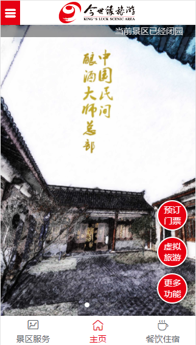
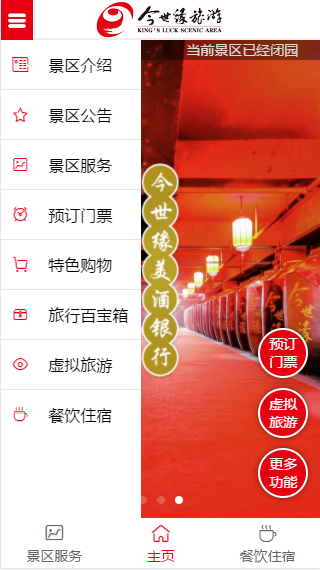
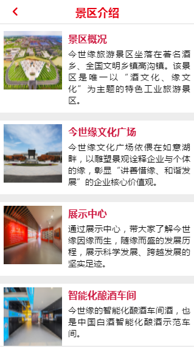
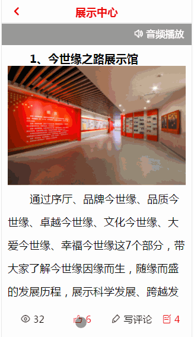
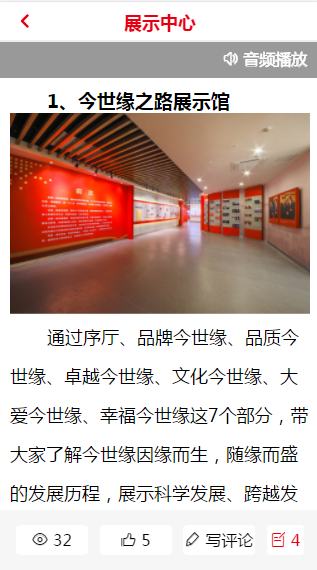
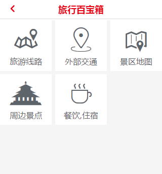

## 项目介绍

这是一个基于vue2, vue-router, axios, express来实现的简单的某个景区H5首页展示页面

## 运行项目

- 克隆整个项目到本地
```
clone https://github.com/wohaiwo/vue-znly.git
```

- 进入项目中，并安装依赖
```
npm install
```

- 打开浏览器，输入**127.0.0.1:8080**
```
npm run dev
```

## 项目截图

### 首页


### 景区介绍

### 评论

### 页面详情

### 百宝箱



# 项目布局
```
|-- build                            // webpack配置文件
|-- config                           // 项目打包路径
|-- dist                           	 // 上线项目文件，放在服务器即可正常访问
|-- screenshots                      // 项目截图
|-- src                              // 源码目录
|   |-- assets                       // 项目静态资源
|   |-- components                   // 组件
|		|-- dropBox                  // 一体机iframe显示框
|		|-- footer                   // 底部导航栏组件
|		|-- header                   // 头部导航栏组件
|		|-- listDetail               // 列表详情组件
|		|-- listTpl                  // 列表组件
|       |-- loading                  // 动态加载组件
|       |-- review                 	 // 页面详情评论组件
|       |-- userCount                // 首页动态滚动条组件
|   |-- page
|       |-- externalMap				 // 百度地图外部接口模块
|       |-- home				 	 // 主页模块
|       |-- scenicIntroduction		 // 景点介绍模块
|       |-- service				     // 景区服务模块
|       |-- travelBox				 // 百宝箱模块
|
|   |-- App.vue                      // 页面入口文件
|
|   |-- main.js                      // 程序入口文件，加载各种公共组件
|
|-- .babelrc                         // ES6语法编译配置
|-- .editorconfig                    // 代码编写规格
|-- .gitignore                       // 忽略的文件
|-- favicon.ico                      // 页面左上角小图标
|-- index.html                       // 入口html文件
|-- package.json                     // 项目及工具的依赖配置文件
|-- README.md                        // 说明
```
